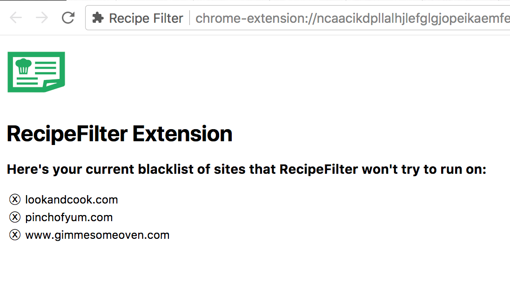

## RecipeFilter Chrome Extension

[Quick video tutorial video here if you want to see it in action](https://www.youtube.com/watch?v=3Xq1p10f3v4).

This Chrome browser extension helps cut through to the chase when browsing food blogs. It is born out of my frustration in having to scroll through a prolix life story before getting to the recipe card that I really want to check out.

It works by identifying recipes in websites that conform to some common patterns. It brings a copy of the recipe card front-and-center and includes a button to dismiss it so you can see the full site. It works in concert with bookmarklets that can save to your favorite recipe manager (i.e. Paprika).

### Installing

Install it using the Google Web Store [here](https://chrome.google.com/webstore/detail/recipe-filter/ahlcdjbkdaegmljnnncfnhiioiadakae).

### Example Screenshot

This site has several pages of text and images before getting to the recipe. With RecipeFilter, the actual recipe is shown at the top of the page when you load it. The contents and formatting are not changed; they are how the author intended. You can dismiss the modal and see the full original site.

### How it Works

The extension quickly checks for the presence of a few common `div` classes and `itemtypes` that are used on recipe cards. If it finds a single recipe on the page, it displays it at the top in a cloned element with the rest of the page dimmed in the background.

It preserves the formatting, images, and styling of the original recipe card as closely as possible; it doesn't try to "sanitize" or reformat the recipe.

Buttons are added to the recipe card to control the extension. You can choose to close the popup or blacklist the site entirely so the extension will no longer try to call out recipes on the current domain.

If you click on the extension icon in the toolbar and select "Options", you will be taken to a page that lets you manage your site blacklist.

### Developing & Contributing

Fork this repo and load it as an unpacked extension. Push your changes and submit a pull request. I will quickly review and get back to you or accept!

- Open chrome://extensions or click `Window > Extensions` in Chrome/Chromium.
- Enable the developer mode at top right.
- Click `Load unpacked extension...` and select the `src` folder that contains `manifest.json`.
- It's installed and running! Load a long-winded recipe page to test it out ([example](https://www.gimmesomeoven.com/instant-pot-steamed-artichokes/))
- As you make changes, just hit "refresh" on the Extensions settings page to reload the plugin.

